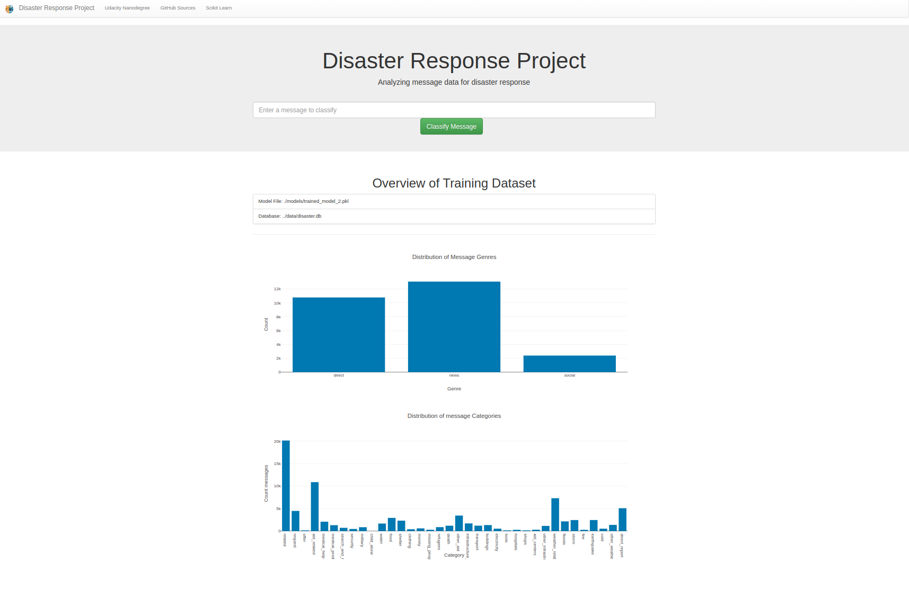
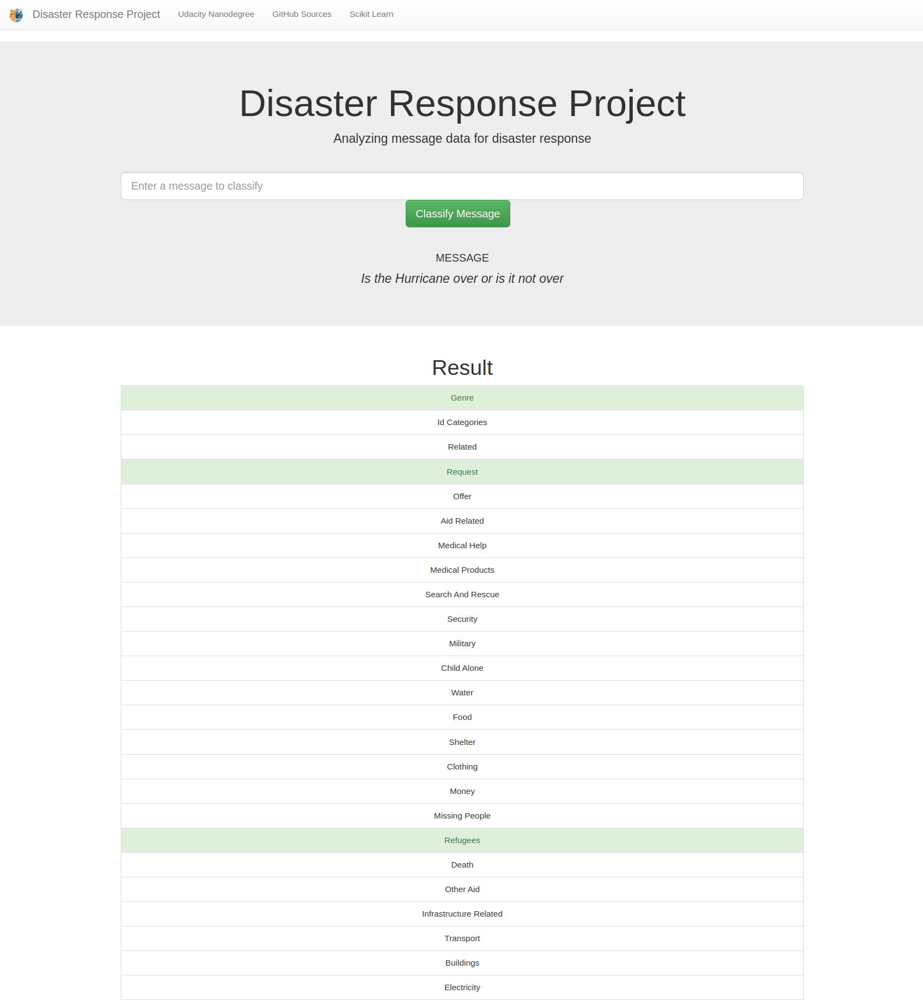

# Disaster Response Pipeline Project
This project is intended to classify social messages after or during a disaster according 
to predefined classes. For example if help of shelter is needed. This seems to be straight forward at first. But 
for example someone who needs drinking water might not use the word 'water' or 'drink'. Instead
she/he might use 'thirsty'. 

This project was set up during the [Udacity](https://www.udacity.com) [data science nanodegree](https://www.udacity.com/course/data-scientist-nanodegree--nd025).  

The data was provided by [figure eight](https://f8federal.com/).

## General
This project consists of three individual scirpts / applications. 
* The first one is responsible for cleaning the data and storing it an a sqlite database. 
* The second script is responsible for utilizing this cleaned data from the database and selecting the best model for classification of the disaster messages. 
* And the third application is responsible for providing a web application for visualization of the results. 

## Folder Structure
This project contains a couple of folders that shall be explained here:

```
.
├── data   (Contains source data files for this project)
│   ├── disaster_categories.csv
│   ├── disaster.db
│   ├── disaster_messages.csv
│   └── __pycache__
├── images   (Images used in this readme)
│   ├── webapp_master.png
├── __init__.py
├── LICENSE
├── notebooks   (Contains Jupyter Notebooks that were used for evaluating the data and setting up the model training)
│   ├── etl_pipeline_preparation.ipynb  (Data preparation notebook)
│   └── model_training_preparation.ipynb   (Model Training notebook)
├── README.md
├── requirements.txt
└── src   (Contains all source files required to run this application)
    ├── data
    │   ├── __init__.py
    │   ├── processor.py
    ├── __init__.py
    ├── models
    │   ├── __init__.py
    │   ├── modeller.py
    │   └── trained_model.pkl
    ├── run_data_processing.py   (Runs the data preparation steps and stores the data in the database)
    ├── run_train_model.py       (Runs the model training and stores the model)
    ├── run_webapp.py            (Run the web application)
    └── webapp
        ├── __init__.py
        ├── templates
        │   ├── go.html
        │   └── master.html
        └── utilities
            ├── arguments.py
            ├── __init__.py
```


## Instructions:
In this section we want to explain how the individual scripts are executed and invoked:

### Data Processing
The data processing script can be found in the "data" folder. The easiest way to invoke it would be like:

```
cd src
python3 run_data_processing.py
```

If everything worked well you will find a "disaster.db" in the data folder. 

The script uses the argparse package for handling input parameters. If you dont specify parameters, the default ones are selected. Here you can find the help for this script:

```
python3 run_data_processing.py -h
```

```
usage: python3 run_data_processing.py [-h] [-m--messages MESSAGES] [-c CATEGORIES]
                                      [-d DATABASE] [--messages_table MESSAGES_TABLE]
                                      [--categories_table CATEGORIES_TABLE]
                                      [-l {error,warn,info,debug}]
                                      [--drop_duplicates {exact,messageonly}]

Processes the raw data from disaster responses and stores it in a database

optional arguments:
  -h, --help            show this help message and exit
  -m--messages MESSAGES
                        The filepath to the csv containing all messages
                        (default: ./disaster_messages.csv)
  -c CATEGORIES, --categories CATEGORIES
                        The filepath to the csv containing all categories
                        (default: ./disaster_categories.csv)
  -d DATABASE, --database DATABASE
                        The filepath to database where we want to store all
                        data (default: ./disaster.db)
  --messages_table MESSAGES_TABLE
                        The table name where we want to store the disaster
                        messages to. (default: Messages)
  --categories_table CATEGORIES_TABLE
                        The table name where we want to store the categories
                        to. (default: Categories)
  -l {error,warn,info,debug}, --loglevel {error,warn,info,debug}
                        The loglevel we want to use for the execution
                        (default: debug)
  --drop_duplicates {exact,messageonly}
                        The specifies if we want to drop only exact duplicates
                        or those where only the message is a duplicate but not

```

### Model Training and selection
To run the model selection you first need to run the data processing script. Otherwise the model training can not load
the disaster messages and will fail. 

In order to call the model training you can call it with the default parameters:

```
cd models
python3 train_classifier.py
```

If everything has worked well, wou will find a "trained_model.pkl" file in the "models" folder.

The script uses the argparse package to handle input arguments. In order to see all available parameters you can call:

```
python3 train_classifier.py -h
```

```
usage: python3 train_classifier.py [-h] [-d DATABASE] [--messages_table MESSAGES_TABLE] [--categories_table CATEGORIES_TABLE]
                                   [--message_limit MESSAGE_LIMIT] [-m MODEL] [-l {error,warn,info,debug}]

Modeling the disaster response message data based on the messages stored in a database

optional arguments:
  -h, --help            show this help message and exit
  -d DATABASE, --database DATABASE
                        The filepath to database where we want to store all data (default: ../data/disaster.db)
  --messages_table MESSAGES_TABLE
                        The table name where to find the messages in the database (default: Messages)
  --categories_table CATEGORIES_TABLE
                        The table name where to find the categories in the database (default: Categories)
  --message_limit MESSAGE_LIMIT
                        The number of messages that shall be read from the database for training. This is especially usefulif you don't have enough RAM /
                        SWAP space on your computer to limit the consumption. The default value(-1) or omitting this parameter disables this feature.
                        (default: -1)
  -m MODEL, --model MODEL
                        The filepath where to store the trained model (default: ./trained_model.pkl)
  -l {error,warn,info,debug}, --loglevel {error,warn,info,debug}
                        The loglevel we want to use for the execution (default: debug)
```

### Web Application
In order to run the web application (after the model has been trained) you can use the following command

```
cd src
python3 run_webapp.py
```

Once the script has loaded you can open a browser with the following URL (http://localhost:3000)

This script also uses the arpparse package and offers the following parameters

```
usage: python3 run_webapp.py [-h] [-m MODEL] [-d DATABASE]

Starting the web application for the disaster message classification

optional arguments:
  -h, --help            show this help message and exit
  -m MODEL, --model MODEL
                        The pretrained model for the classification (default: ./models/trained_model_2.pkl)
  -d DATABASE, --database DATABASE
                        The filepath to database where we want to store all data (default: ../data/disaster.db)

```

## Results
Once all steps have been carried out you will see a web site like below:


You can classify a message via the text box and you will see something like this:


## Caveats
1. On my local computer training the model ran out of memory (including SWAP space), resulting in the training to be terminated by a 'Interupted by signal 9: SIGKILL'. That is why I needed to increase
the SWAP size of my computer. In order to change the SWAP size on your computer, use the following commands

   Turn off all running swap processes: 
   ```
   sudo swapoff -a
   ```
   Resize SWAP (replace the 64G with any value you like)
   ```
   sudo fallocate -l 64G /swapfile
   ```
   CHMOD swap
   ```
   sudo chmod 600 /swapfile
   ```
   Make file usable as swap
   ```
   sudo mkswap /swapfile
   ```
   Activate the SWAP file
   ```
   sudo swapon /swapfile
   ```
   
   Another option there is to reduce memory consumption is to limit the amount of messages to be used during training.
   For this we can use the 'message_limit' parameter
   